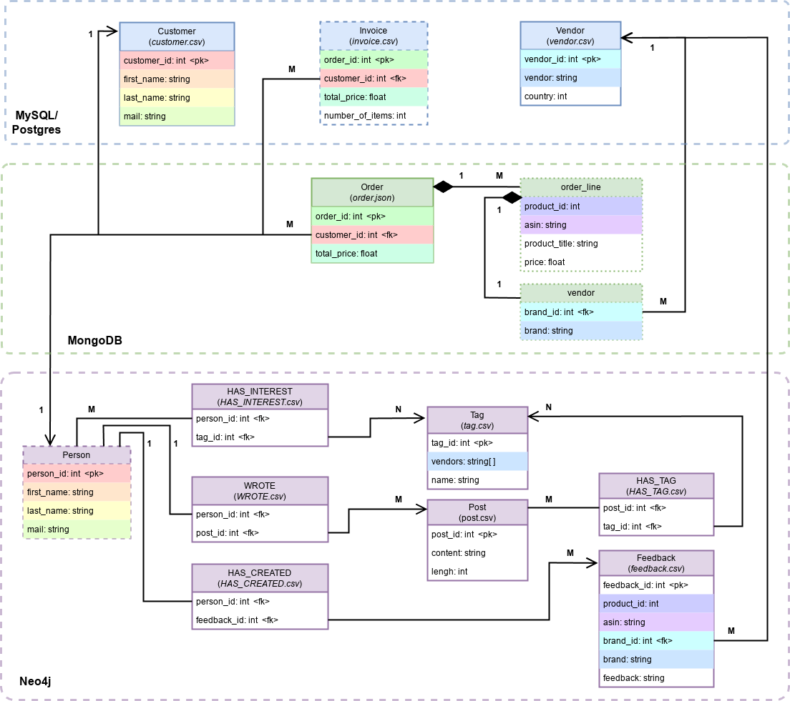
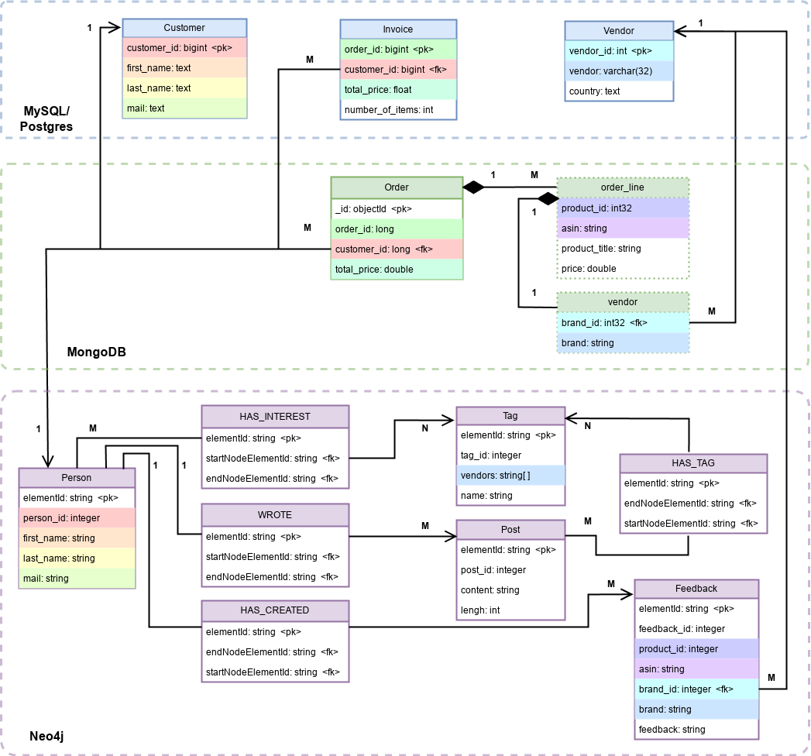

# UniBench Test Data for Detection of Inclusion Dependencies

This repository contains test data for the detection of inclusion dependencies. The data set is based on the UniBench data set and is generated with the data generator provided in this repository. The data generator is written in Python and uses the Faker library.
The data is already imported into the databases which are provided as docker images.


**Contents:**

- [UniBench Test Data for Detection of Inclusion Dependencies](#unibench-test-data-for-detection-of-inclusion-dependencies)
  - [Quick Start](#quick-start)
  - [Test Data](#test-data)
  - [Data Generator](#data-generator)
    - [Installation](#installation)
    - [Usage](#usage)

## Quick Start

To start the databases with a scale factor of 0.01, run the following command:
```bash
DATA_SIZE=0.01 docker compose up -d
```

## Test Data

The following figure shows the UML diagram of the test data (the different colors of the attributes represent the inclusion dependencies):



The data is already imported into the databases which are provided as docker images.
There are also data sets in different sizes available:


| Scale Factor | Person / Customer | Order / Invoice | Vendor | Post  | Tag | Feedback |
|--------------|-------------------|-----------------|--------|-------|-----| -------- |
| 0.0          | 4                 | 8               | 66     | 8     | 8   | 14       |
| 0.01         | 99                | 1422            | 66     | 12319 | 90  | 2528     |
| 0.02         | 198               | 2845            | 66     | 24639 | 180 | 4980     |
| 0.03         | 298               | 4267            | 66     | 36959 | 272 | 7472     |
| 0.04         | 397               | 5690            | 66     | 49279 | 363 | 9894     |


The following table shows the default credentials for the databases:

| Database | Username | Password      | Database Name |
|----------|----------|---------------|---------------|
| MySQL    | root     | root          | unibench      |
| Postgres | postgres | root          | unibench      |
| MongoDB  | -        | -             | unibench      |
| Neo4j    | neo4j    | neo4jpassword | neo4j         |


The following uml diagram shows the schema of the databases after the data import:




## Data Generator

The data generator is written in Python and uses the Faker library to generate the data.

### Installation

Change to the data-generator directory
```bash
cd data-generator
```

Setup the venv
```bash
python -m venv venv
```

Activate the venv
```bash
source venv/bin/activate
```

Install the requirements
```bash
pip install -r requirements.txt
```

### Usage

To only generate the data run the data generator with the required scale factor and `-g` flag:
```bash
./run.sh -s 0.01 -g
```

To import the data into the databases and also build the docker images, run the data generator with the following command:
```bash
./run.sh -s 0.01 -l mongodb,neo4j,mysql,postgres -i -b
```
